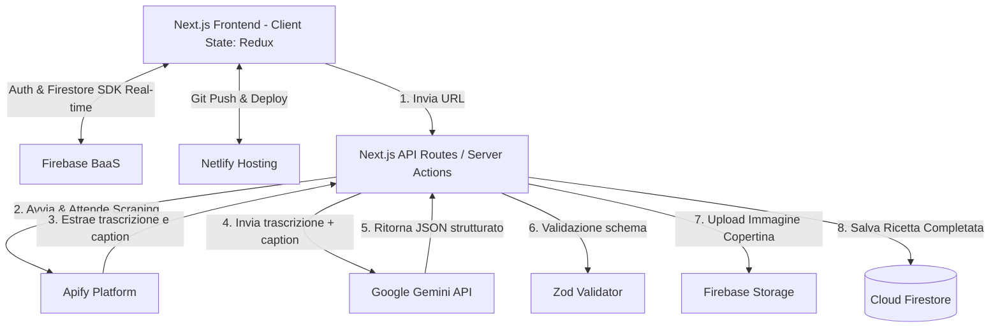

# Analisi Tecnica dello Stack - Ricette Smart

Questo documento descrive lo stack tecnologico, l'architettura di sistema e le scelte di implementazione per l'applicazione di **Gestione e Importazione Ricette Smart**, definite a partire dall'[Analisi Funzionale](file:///Users/riccardo-z/Documents/dev/analisiFunzionale.md) e dalle indicazioni fornite.

---

## 1. Architettura di Sistema ed Integrazioni

L'applicazione adotta un'architettura **Serverless / Jamstack** integrata con servizi cloud in tempo reale. La pipeline di ingestion funziona in modo lineare senza l'ausilio di webhook per semplificare il flusso di controllo.



---

## 2. Stack Tecnologico Dettagliato

### 2.1 Frontend & Core Framework
* **Next.js 16 (App Router)**: Framework di riferimento per la gestione del routing, Server Components (RSC) e Server Actions.
* **TypeScript**: Linguaggio principale per garantire type-safety e manutenibilità.
* **i18n (Internazionalizzazione)**: Gestione delle label multilingua tramite librerie come `next-intl` o `react-i18next` integrate con Next.js App Router.
  * *Lingue supportate inizialmente*: **Italiano (it)** ed **Inglese (en)**.

### 2.2 UI & Styling
* **shadcn/ui**: Libreria di componenti UI riutilizzabili.
* **Tailwind CSS**: Motore grafico utility-first integrato per la stilizzazione e l'estetica premium dell'applicazione.

### 2.3 Stato Locale & Globale
* **Redux Toolkit**: Utilizzato **esclusivamente per la gestione dello stato di sessione** temporaneo del client (es. stato di caricamento dell'interfaccia, token temporanei di navigazione, filtri di ricerca volatili).
* **Sincronizzazione Real-Time**: Tutti i dati applicativi persistenti (Ricettario, Lista della Spesa e Checklist dei prodotti acquistati) vengono sincronizzati in tempo reale tra client e database tramite l'SDK Firestore, senza passare per lo stato globale persistito di Redux.

### 2.4 Backend-as-a-Service (BaaS) - Firebase
* **Firebase Authentication**: Gestione dell'autenticazione limitata a:
  * Social Login tramite **Google**.
  * Autenticazione tradizionale tramite **Email e Password**.
* **Cloud Firestore**: Database NoSQL in tempo reale per la persistenza dei dati (ricette, liste della spesa).
* **Firebase Storage**: Utilizzato per archiviare in modo permanente le immagini di copertina delle ricette estratte.
* **Firebase Analytics**: Monitoraggio degli eventi utente e metriche di utilizzo.

### 2.5 Hosting, Deployment & Secrets
* **GitHub**: Piattaforma di versionamento e repository manager.
* **Netlify**: Hosting del frontend Next.js 16 ed esecuzione delle Serverless/Background Functions.
  * *Secret Manager*: Configurazione e cifratura delle chiavi API (Gemini API, Apify Token, Firebase Admin SDK credentials).

### 2.6 Pipeline di Ingestion & IA
* **Apify**: Esegue lo scraping mirato del link inviato (Instagram Reel, TikTok o siti web) ed estrae:
  1. I metadati del post e la caption.
  2. La trascrizione audio del video (tramite tool di speech-to-text interni di Apify).
* **Google Gemini API (`gemini-3.5-flash` / `gemini-3.1-pro`)**: Riceve in input la caption e la trascrizione di Apify per generare un JSON strutturato con dosi, ingredienti e passaggi.
* **Zod**: Validazione a runtime del JSON generato da Gemini per garantire la coerenza con lo schema del database.

---

## 3. Schema Dati e Validazione (Zod)

Il JSON generato da Gemini viene validato con lo schema Zod prima del salvataggio su Firestore:

```typescript
import { z } from 'zod';

export const IngredientSchema = z.object({
  name: z.string().min(1, "Il nome dell'ingrediente è obbligatorio"),
  quantity: z.number().nonnegative("La quantità deve essere positiva").nullable(),
  unit: z.string().default("q.b.") // g, kg, ml, cucchiai, pezzi, ecc.
});

export const RecipeSchema = z.object({
  title: z.string().min(1, "Il titolo è obbligatorio"),
  sourceUrl: z.string().url("URL sorgente non valido"),
  servings: z.number().int().positive().default(2),
  ingredients: z.array(IngredientSchema),
  instructions: z.array(z.string().min(1)),
  imageUrl: z.string().url().nullable().optional(),
  prepTimeMinutes: z.number().int().nonnegative().nullable().optional(),
});

export type Recipe = z.infer<typeof RecipeSchema>;
```

---

## 4. Scelte Architetturali Definite e Gestione Rischi

### 4.1 Pipeline di Ingestion Lineare (Senza Webhook) e Gestione dei Timeout
Dato che il flusso non prevede webhook, l'applicazione attende in modo sincrono che Apify completi lo scraping e la trascrizione, per poi invocare Gemini ed infine restituire la ricetta strutturata al client.

**Rischio Timeout su Netlify:**
Le Serverless Functions di Netlify hanno un limite di esecuzione standard di 10 secondi (estendibile a 26 secondi). La pipeline Apify (scraping + trascrizione) + Gemini può superare questo limite.

**Strategia di Risoluzione:**
1. **Netlify Background Functions**: Utilizzo delle funzioni in background di Netlify (che permettono un tempo di esecuzione fino a 15 minuti). La funzione in background viene avviata dal client, scrive direttamente il risultato finale in Firestore su completamento e il client, in ascolto tramite Firestore SDK real-time, aggiorna l'UI non appena il documento viene popolato.
2. **Orchestrazione Client-Side (Alternativa)**: Il client Next.js avvia la chiamata ad Apify tramite SDK client, attende il completamento, invia i dati grezzi a una Server Action sicura per l'elaborazione con Gemini, valida con Zod e salva in Firestore. Questo sposta l'attesa sul browser del client evitando il timeout serverless di Netlify.

### 4.2 Persistenza Immagini in Firebase Storage
Per evitare che i link delle immagini di Instagram/TikTok scadano (le CDN dei social applicano token temporanei di poche ore):
1. Durante l'importazione, la Serverless Function scarica temporaneamente l'immagine trovata da Apify.
2. Esegue l'upload del file binario su **Firebase Storage** in una cartella strutturata (es. `recipes/{userId}/{recipeId}.jpg`).
3. Salva l'URL pubblico di Firebase Storage nel documento Firestore della ricetta.

### 4.3 Internazionalizzazione (i18n)
L'interfaccia utente è interamente localizzata. La struttura delle cartelle Next.js 16 utilizzerà il routing basato sul locale (es. `/it/dashboard` o `/en/dashboard`). Le label statiche dell'applicazione verranno caricate dai file di traduzione (`it.json` e `en.json`).
I dati del database (es. nomi degli ingredienti importati) rimarranno nella lingua originale del video importato, ma l'interfaccia dell'applicazione garantirà piena usabilità in entrambe le lingue.
