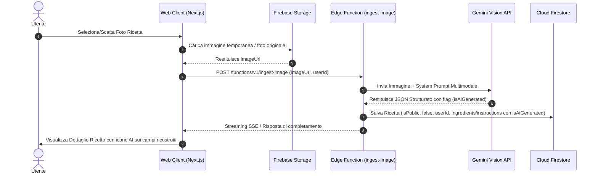

# Analisi Funzionale e Tecnica: Ingestione Ricette da Immagine (OCR & Vision AI)

Questo documento definisce l'analisi funzionale e tecnica dettagliata per la nuova funzionalità di **Ingestione Ricette tramite Immagine** (screenshot, foto di ricettari cartacei o appunti), l'integrazione della **Edge Function di analisi multimodale**, la gestione della **privacy/esclusione dal feed pubblico** e il sistema di **tracciamento ed evidenziazione dei contenuti generati autonomamente dall'IA**.

---

## 1. Visione Generale ed Obiettivi

### 1.1 Il Problema
Attualmente l'applicazione permette l'ingestione automatica di ricette a partire da URL (Instagram Reel, TikTok, YouTube, siti web). Tuttavia, gli utenti possiedono ricette salvate sotto forma di:
- Screenshot dallo smartphone (storie Instagram, post social senza link diretto, note, chat WhatsApp).
- Foto scattate a libri di cucina, riviste o ricettari cartacei scritti a mano.

Spesso questi screenshot/foto:
1. **Sono incompleti**: ad esempio mostrano la foto del piatto e la lista degli ingredienti, ma non il procedimento passo-passo o i tempi di cottura.
2. **Contengono ricette personali/familiari**: l'utente non vuole che la foto della ricetta della nonna o uno screenshot privato finisca nel feed pubblico della community.

### 1.2 La Soluzione
Fornire un sistema di importazione tramite caricamento di un'immagine (file da galleria o scatto da fotocamera). Il sistema:
1. **Elabora l'immagine con Gemini Vision**: estrae i dati visibili e completa *autonomamente* le informazioni mancanti o incomplete.
2. **Garantisce la Privacy**: la ricetta viene salvata come **Privata** (`isPublic: false`), rendendola visibile unicamente all'utente che l'ha caricata ed escludendola automaticamente dal feed pubblico.
3. **Fornisce Trasparenza sull'AI**: ogni campo o passaggio generato/inferito dall'IA (non esplicitamente presente nell'immagine) viene contrassegnato con un metadato (`isAiGenerated: true`) e visualizzato nell'interfaccia utente con una distinta **icona AI** (es. `✨` o badge dedicato), permettendo all'utente di distinguere a colpo d'occhio i dati estratti dall'immagine rispetto a quelli ricostruiti dal modello.

---

## 2. Analisi Funzionale

### 2.1 Requisiti Funzionali

| ID | Requisito | Descrizione |
|---|---|---|
| **RF-01** | Caricamento Immagine | L'utente può caricare una o più immagini (JPEG, PNG, WEBP, HEIC) tramite drag & drop o scatto diretto da fotocamera mobile. |
| **RF-02** | Estrazione e Strutturazione | Il sistema estrae il titolo, porzioni, tempi, ingredienti e procedimento presenti nell'immagine. |
| **RF-03** | Autocompletamento IA | Se l'immagine è parziale (es. mancano le dosi, i passaggi o i macronutrienti), l'IA arricchisce e completa autonomamente la ricetta. |
| **RF-04** | Flag di Provenienza AI | Ogni ingrediente, passaggio di istruzioni e metadato principale traccia se è stato estratto o generato dall'IA. |
| **RF-05** | Isolamento Feed / Privacy | Le ricette create da foto/screenshot nascono automaticamente con `isPublic: false` (o `visibility: 'private'`). Non appaiono nel feed pubblico della community né nelle ricerche globali. |
| **RF-06** | Evidenziazione Visiva UX | Nell'interfaccia di dettaglio e modifica ricetta, viene mostrata un'icona specifica accanto ai campi generati dall'IA. |
| **RF-07** | Controllo Utente & Editing | L'utente può modificare qualsiasi campo (sia estratto che generato) ed eventualmente rimuovere l'indicazione di generazione AI una volta confermato il valore. |

---

### 2.2 Flussi Utente (User Flows)



---

### 2.3 User Interface (UX / UI Design Guidelines)

1. **Drawer / Modal di Importazione**:
   - Aggiunta di una tab o opzione "Carica Screenshot / Foto".
   - Supporto all'anteprima dell'immagine caricata prima dell'invio.
   - Stato di caricamento animato con avanzamento (es. *"Analisi visiva dell'immagine in corso..."* -> *"Ricostruzione passaggi mancanti con IA..."*).

2. **Dettaglio Ricetta & Indicatore AI**:
   - **Icona AI (`✨` Sparkles / Wand)**: Posizionata a fianco del nome dell'ingrediente, della quantità o del singolo passaggio delle istruzioni qualora `isAiGenerated` sia `true`.
   - **Tooltip Esplicativo**: Al passaggio del mouse / tap sull'icona: *"Questo passaggio non era presente nell'immagine ed è stato stimato dall'IA. Puoi modificarlo in qualsiasi momento."*
   - **Badge Privacy**: Indicatore visivo in testa alla ricetta: `🔒 Ricetta Privata` (con spiegazione: *"Visibile solo nel tuo ricettario personale"*).

---

## 3. Analisi Tecnica ed Architettura

### 3.1 Nuova Edge Function: `ingest-image`

Verrà creata la seguente funzione Supabase Edge Function:
`supabase/functions/ingest-image/index.ts`

#### Endpoint & Parametri di Ingresso
* **Method:** `POST`
* **URL:** `https://<project-ref>.supabase.co/functions/v1/ingest-image`
* **Headers:** `Authorization: Bearer <user_token>`, `Content-Type: application/json`
* **Request Body:**
```json
{
  "imageUrl": "https://storage.googleapis.com/.../raw_upload.jpg",
  "userId": "firebase_uid_123",
  "userEmail": "user@example.com"
}
```

---

### 3.2 Modello Dati e Schema Firestore

Per supportare l'isolamento della privacy e il tracciamento dei campi generati dall'IA, estendiamo lo schema del documento `recipes` in Firestore e il corrispondente schema di validazione Zod.

#### Schema TypeScript Aggiornato (`recipes` Collection)

```typescript
export interface IngredientWithProvenance {
  name: string;
  quantity: number | null;
  unit: string;
  isAiGenerated: boolean; // true se l'ingrediente o le dosi sono state completate dall'IA
}

export interface InstructionWithProvenance {
  step: number;
  text: string;
  isAiGenerated: boolean; // true se il passaggio è stato generato dall'IA
}

export interface RecipeDocument {
  id: string;
  userId: string;
  title: string;
  isTitleAiGenerated: boolean;
  
  // Impostazione di Privacy per il Feed Pubblico
  isPublic: boolean; // Tassativamente FALSE per ingest da immagine
  sourceType: 'image_upload' | 'url_ingest' | 'manual';
  sourceUrl?: string | null;
  sourceImageUrl?: string | null; // URL della foto/screenshot originale dell'utente
  imageUrl?: string | null;       // Immagine di copertina generata/ottimizzata
  
  servings: number;
  isServingsAiGenerated: boolean;
  
  prepTimeMinutes: number | null;
  isPrepTimeAiGenerated: boolean;
  
  category: 'first_courses' | 'second_courses' | 'desserts' | 'appetizers' | 'sides' | 'single_dishes' | 'other';
  
  ingredients: IngredientWithProvenance[];
  instructions: InstructionWithProvenance[];
  
  // Valori nutrizionali e dietetici
  kcal: number | null;
  proteins: number | null;
  carbs: number | null;
  fats: number | null;
  fiber: number | null;
  sugar: number | null;
  isNutritionalAiGenerated: boolean;
  
  nutritionalRating: 'A' | 'B' | 'C' | 'D' | 'E' | null;
  nutritionalAssessment: string | null;
  
  isGlutenFree: boolean | null;
  isVegan: boolean | null;
  isVegetarian: boolean | null;
  isLactoseFree: boolean | null;
  
  createdAt: any; // Firestore Timestamp
  updatedAt: any; // Firestore Timestamp
}
```

---

### 3.3 Prompt Engineering & Strategia Gemini Vision

Utilizzeremo la funzionalità Multimodale di Google Gemini (tramite OpenRouter o SDK ufficiale Gemini Vision, ad esempio `google/gemini-2.0-flash-001` o `google/gemini-1.5-flash`).

#### Prompt di Sistema per l'Analisi Visiva e Completion

```text
Sei un assistente culinario esperto e meticoloso con capacità avanzate di Visione Artificiale (OCR + Comprensione Culinaria).

Compito:
1. Analizza l'immagine fornita (che può essere una foto di una ricetta, uno screenshot di un social network o un appunto).
2. Estrai tutti gli elementi testuali e visivi presenti nell'immagine.
3. Se l'immagine NON contiene tutte le informazioni necessarie per rendere la ricetta completa ed eseguibile (ad esempio mancano i passaggi del procedimento, le dosi di alcuni ingredienti, il tempo di preparazione o le porzioni), COMPLETA E RIGENERA AUTONOMAMENTE ciò che manca basandoti sulla tua conoscenza culinaria.

REGLA FONDAMENTALE SULLA PROVENIENZA DEI DATI (isAiGenerated):
- Per OGNI ingrediente e OGNI passaggio delle istruzioni, devi specificare il booleano "isAiGenerated":
  * imposta "isAiGenerated": false SE E SOLO SE l'informazione era presente ed chiaramente leggibile nell'immagine.
  * imposta "isAiGenerated": true SE l'informazione NON era presente nell'immagine ed è stata da te dedotta, completata o inventata per rendere la ricetta valida.

Formato di output JSON richiesto:
{
  "title": "Titolo della ricetta (string)",
  "isTitleAiGenerated": boolean,
  "servings": integer,
  "isServingsAiGenerated": boolean,
  "prepTimeMinutes": integer o null,
  "isPrepTimeAiGenerated": boolean,
  "category": "first_courses" | "second_courses" | "desserts" | "appetizers" | "sides" | "single_dishes" | "other",
  "ingredients": [
    {
      "name": "Nome ingrediente",
      "quantity": number o null,
      "unit": "g" | "ml" | "q.b." | "",
      "isAiGenerated": boolean
    }
  ],
  "instructions": [
    {
      "step": 1,
      "text": "Descrizione del passaggio...",
      "isAiGenerated": boolean
    }
  ],
  "kcal": number o null,
  "proteins": number o null,
  "carbs": number o null,
  "fats": number o null,
  "fiber": number o null,
  "sugar": number o null,
  "isNutritionalAiGenerated": boolean,
  "nutritionalRating": "A" | "B" | "C" | "D" | "E" | null,
  "nutritionalAssessment": "Breve frase di commento nutrizionale",
  "isGlutenFree": boolean,
  "isVegan": boolean,
  "isVegetarian": boolean,
  "isLactoseFree": boolean
}
```

---

### 3.4 Regole di Sicurezza Firestore (Security Rules & Query Feed)

#### 1. Security Rules (`firestore.rules`)
Garantire che le ricette private (`isPublic == false`) siano accessibili in lettura ed eliminazione solo dall'utente proprietario.

```javascript
match /recipes/{recipeId} {
  // Lettura consentita se la ricetta è pubblica OPPURE se l'utente è il proprietario
  allow read: if resource.data.isPublic == true || 
                 (request.auth != null && request.auth.uid == resource.data.userId);
                 
  // Creazione e modifica consentita solo al proprietario
  allow create, update, delete: if request.auth != null && request.auth.uid == request.resource.data.userId;
}
```

#### 2. Query per il Feed Pubblico
Le query che popolano la sezione "Esplora" o "Feed Pubblico" devono applicare tassativamente la clausola di filtro:

```typescript
const publicRecipesQuery = query(
  collection(db, "recipes"),
  where("isPublic", "==", true),
  orderBy("createdAt", "desc"),
  limit(20)
);
```

In questo modo, tutte le ricette caricate via immagine (avendo `isPublic: false`) sono escluse a livello di database da qualsiasi visualizzazione pubblica.

---

## 4. Matrice di Confronto: Ingest da URL vs Ingest da Immagine

| Caratteristica | Ingest da URL (Esistente) | Ingest da Immagine (Nuovo) |
|---|---|---|
| **Input** | Link HTTP (Instagram, TikTok, Web) | File Immagine / Foto / Screenshot |
| **Pipeline Scraper** | ScrapeCreators API / Web Scraper | Upload su Storage + Gemini Vision API |
| **Visibilità Default** | Pubblica (`isPublic: true`) | Privata (`isPublic: false`) |
| **Completezza Input** | Solitamente alta (caption + audio) | Spesso parziale (solo foto o lista ingredienti) |
| **AI Completion** | Estrazione e strutturazione | Estrazione OCR + Sintesi autonoma passaggi mancanti |
| **UX Indicatori AI** | Non richiesti (o globali) | Icona `✨` per singolo ingrediente/istruzione |

---

## 5. Piano di Implementazione a Fasi

1. **Fase 1: Schema Dati & Componenti UI Base**
   - Aggiornamento dei tipi TypeScript (`src/types/recipe.ts`) e dello schema Zod.
   - Creazione del componente UI per l'icona AI (`<AiGeneratedBadge />` e tooltip).
2. **Fase 2: Edge Function `ingest-image`**
   - Creazione della cartella `supabase/functions/ingest-image`.
   - Implementazione della chiamata multimodale a Gemini Vision.
   - Validazione dell'output ed arricchimento con metadati `isAiGenerated`.
3. **Fase 3: Integrazione Frontend & Upload Immagine**
   - Aggiunta dell'opzione di upload immagine nella dashboard/drawer di importazione.
   - Upload dell'immagine su Backblaze B2 / Firebase Storage.
   - Invocazione dell'Edge Function `ingest-image`.
4. **Fase 4: Feed & Rules Verification**
   - Aggiornamento delle Firestore Security Rules per verificare l'isolamento delle ricette private.
   - Test end-to-end con screenshot parziali e foto di ricettari cartacei.

---

## 6. Conclusioni
La funzionalità di Ingest da Immagine espande significativamente le capacità di GustoSmart, trasformando qualsiasi contenuto visivo (anche incompleto) in una ricetta utilizzabile e pronta per il ricalcolo dosi e la lista della spesa smart, tutelando la privacy dell'utente e garantendo massima trasparenza sul ruolo dell'IA.
