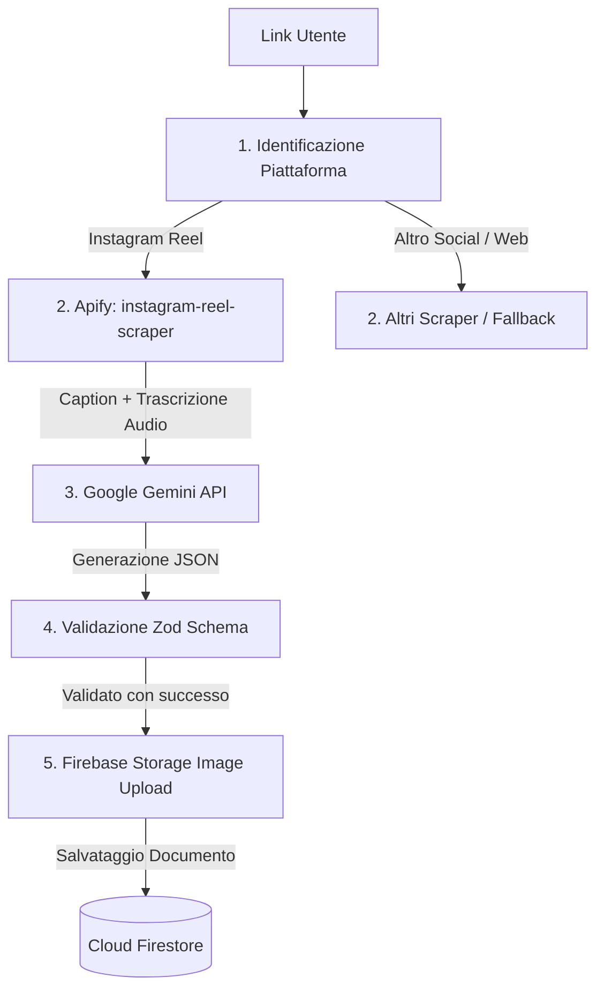
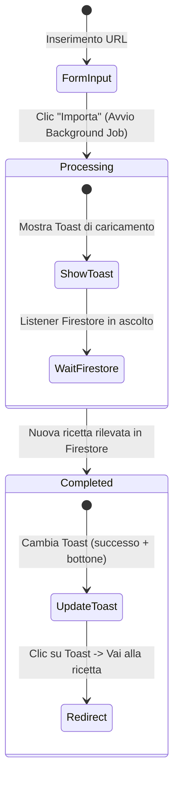

# Pipeline di Ingestione Ricette (Scraping & IA)

Questo documento descrive in dettaglio la pipeline tecnica per l'importazione automatica delle ricette a partire da link social (Instagram, TikTok, YouTube o siti web), integrando **Apify**, **Google Gemini** e la validazione tramite **Zod**.

---

## 1. Architettura della Pipeline

La pipeline riceve in input un URL inserito dall'utente e restituisce una ricetta strutturata e validata pronta per il salvataggio su Firestore.



---

## 2. Identificazione della Piattaforma (Router del Link)

Prima di avviare lo scraping, l'applicazione deve identificare a quale social appartiene il link. Questo permette di instradare la chiamata verso lo scraper corretto.

### Specifiche Tecniche
* **File consigliato:** `src/lib/scraping/detector.ts`
* **Funzione:** `identifyPlatform(url: string): 'instagram' | 'tiktok' | 'youtube' | 'web'`

### Esempio di Implementazione (TypeScript)
```typescript
/**
 * Identifica la piattaforma di provenienza di un dato URL.
 */
export function identifyPlatform(url: string): 'instagram' | 'tiktok' | 'youtube' | 'web' {
  if (!url) {
    throw new Error("URL non valido o vuoto");
  }
  
  const cleanUrl = url.trim().toLowerCase();
  
  if (cleanUrl.includes('instagram.com') || cleanUrl.includes('instagr.am')) {
    return 'instagram';
  }
  
  if (cleanUrl.includes('tiktok.com')) {
    return 'tiktok';
  }
  
  if (cleanUrl.includes('youtube.com') || cleanUrl.includes('youtu.be')) {
    return 'youtube';
  }
  
  return 'web';
}
```

---

## 3. Integrazione con Apify (Instagram Reel Scraper)

Per lo scraping dei reel di Instagram viene utilizzato l'actor [apify/instagram-reel-scraper](https://apify.com/apify/instagram-reel-scraper).

### Parametri di Input
Per abilitare la trascrizione audio del video, è necessario attivare la proprietà `includeTranscript: true`.

```json
{
  "username": [
    "https://www.instagram.com/reel/C789example/"
  ],
  "resultsLimit": 1,
  "includeTranscript": true
}
```

> [!IMPORTANT]
> L'opzione `includeTranscript` è un add-on di Apify che utilizza modelli di speech-to-text (es. Whisper) per convertire l'audio del video in testo. Assicurarsi che l'account Apify abbia i crediti necessari abilitati.

### Gestione del Timeout e Polling
Le Serverless Functions di Netlify hanno un limite di timeout di 10-26 secondi. Lo scraping di Apify con trascrizione può richiedere più tempo (fino a 30-45 secondi). Si consigliano due approcci per evitare il timeout:

#### Opzione A: Avvio Asincrono + Polling Client-side (Consigliato)
1. Il client avvia l'importazione chiamando una Route API `/api/ingest`.
2. Il server avvia il run di Apify in modo asincrono (senza attendere il completamento) e restituisce un `runId`.
3. Il client esegue un polling verso un endpoint di stato (o attende la scrittura in Firestore se si usa una Background Function).

#### Opzione B: Chiamata Sincrona con `wait` (per Background Functions)
Se eseguito all'interno di una Netlify Background Function (limite di 15 minuti) o se si vuole attendere in modo sincrono fino a 60 secondi:
```typescript
const apifyToken = process.env.APIFY_API_TOKEN;
const actorId = "apify~instagram-reel-scraper";

// Usiamo il parametro &wait=60 per tenere aperta la connessione HTTP fino al termine del job
const runResponse = await fetch(
  `https://api.apify.com/v2/acts/${actorId}/runs?token=${apifyToken}&wait=60`,
  {
    method: "POST",
    headers: {
      "Content-Type": "application/json",
    },
    body: JSON.stringify({
      username: [reelUrl],
      resultsLimit: 1,
      includeTranscript: true,
    }),
  }
);

if (!runResponse.ok) {
  throw new Error("Errore durante l'avvio dello scraper Apify");
}

const runData = await runResponse.json();
const datasetId = runData.data.defaultDatasetId;

// Recuperiamo i dati estratti dal Dataset
const datasetResponse = await fetch(
  `https://api.apify.com/v2/datasets/${datasetId}/items?token=${apifyToken}`
);

const items = await datasetResponse.json();
if (!items || items.length === 0) {
  throw new Error("Nessun dato estratto dallo scraper");
}

const scrapedData = items[0];
const caption = scrapedData.caption || "";
const transcript = scrapedData.transcript || scrapedData.videoTranscript || "";
const coverImageUrl = scrapedData.displayUrl || scrapedData.videoPlayUrl || null;
```

---

## 4. Elaborazione con Google Gemini (Generazione JSON Strutturato)

Una volta ottenute la `caption` (descrizione testuale del post) e la `transcript` (trascrizione dell'audio), i dati vengono passati a Gemini per mapparli nel formato strutturato richiesto dal frontend.

### Configurazione SDK
Utilizzare il pacchetto `@google/generative-ai` (già presente in `package.json`).

* **Modello consigliato:** `gemini-3.5-flash-lite` o simili a seconda della disponibilità API.
* **Configurazione:** Impostare `responseMimeType: "application/json"` e passare lo schema strutturato per forzare il modello a rispondere esclusivamente con un JSON valido.

### Esempio di Richiesta Gemini con Structured Output
```typescript
import { GoogleGenerativeAI, Type } from "@google/generative-ai";

const genAI = new GoogleGenerativeAI(process.env.GEMINI_API_KEY!);

export async function generateRecipeFromText(caption: string, transcript: string): Promise<any> {
  const model = genAI.getGenerativeModel({
    model: "gemini-3.5-flash-lite",
    generationConfig: {
      responseMimeType: "application/json",
      responseSchema: {
        type: Type.OBJECT,
        properties: {
          title: { type: Type.STRING, description: "Il titolo accattivante della ricetta" },
          servings: { type: Type.INTEGER, description: "Numero di porzioni per cui sono calibrati gli ingredienti (default: 2)" },
          prepTimeMinutes: { type: Type.INTEGER, description: "Tempo di preparazione in minuti, nullo se non deducibile" },
          ingredients: {
            type: Type.ARRAY,
            description: "Lista completa degli ingredienti necessari",
            items: {
              type: Type.OBJECT,
              properties: {
                name: { type: Type.STRING, description: "Nome dell'ingrediente (es. Farina 00, Uova)" },
                quantity: { type: Type.NUMBER, description: "Quantità numerica (es. 150, 3), nullo se a sentimento o q.b." },
                unit: { type: Type.STRING, description: "Unità di misura (es. g, ml, cucchiai, pezzi), default 'q.b.'" }
              },
              required: ["name", "unit"]
            }
          },
          instructions: {
            type: Type.ARRAY,
            description: "Istruzioni passo dopo passo per la preparazione della ricetta",
            items: { type: Type.STRING }
          }
        },
        required: ["title", "servings", "ingredients", "instructions"]
      }
    }
  });

  const prompt = `
Sei un assistente culinario esperto. Analizza la descrizione del post (Caption) e la trascrizione audio (Transcript) di un video di cucina per estrarre la ricetta strutturata.

Dati del video:
---
CAPTION:
${caption}

TRASCRIZIONE AUDIO:
${transcript}
---

Istruzioni importanti:
1. Traduci e adatta i termini degli ingredienti se necessario.
2. Se le quantità non sono specificate, imposta quantity a null e unit a 'q.b.'.
3. Ordina le istruzioni in modo logico e cronologico.
4. Genera solo ed esclusivamente l'oggetto JSON richiesto dallo schema.
`;

  const result = await model.generateContent(prompt);
  const responseText = result.response.text();
  return JSON.parse(responseText);
}
```

---

## 5. Validazione dello Schema (Zod)

Prima di persistere il documento in Firestore, il JSON generato da Gemini deve essere validato a runtime con **Zod** per assicurare la type-safety e prevenire errori di inserimento dati.

### Zod Schema di Validazione
Ispirato a [analisiTecnicaStack.md](file:///Users/riccardo-z/Documents/dev/context/analisiTecnicaStack.md#L72-L89):

```typescript
import { z } from 'zod';

export const IngredientSchema = z.object({
  name: z.string().min(1, "Il nome dell'ingrediente è obbligatorio"),
  quantity: z.number().nonnegative("La quantità deve essere positiva").nullable(),
  unit: z.string().default("q.b.")
});

export const RecipeSchema = z.object({
  title: z.string().min(1, "Il titolo è obbligatorio"),
  sourceUrl: z.string().url("URL sorgente non valido"),
  servings: z.number().int().positive().default(2),
  ingredients: z.array(IngredientSchema),
  instructions: z.array(z.string().min(1)),
  imageUrl: z.string().url().nullable().optional(),
  prepTimeMinutes: z.number().int().nonnegative().nullable().optional(),
});

export type RecipeInput = z.infer<typeof RecipeSchema>;
```

### Esempio di Validazione e Correzione
```typescript
export function validateAndFormatRecipe(
  geminiOutput: any,
  sourceUrl: string,
  imageUrl: string | null
): RecipeInput {
  // Arricchiamo l'output di Gemini con i metadati raccolti dallo scraping
  const rawRecipe = {
    ...geminiOutput,
    sourceUrl,
    imageUrl: imageUrl || null
  };

  // Validazione Zod
  const validationResult = RecipeSchema.safeParse(rawRecipe);

  if (!validationResult.success) {
    console.error("Zod Validation Errors:", validationResult.error.format());
    throw new Error("Il JSON generato non rispetta lo schema richiesto.");
  }

  return validationResult.data;
}
```

---

## 6. Persistenza e Allineamento all'Interface Agreement

Una volta validata, la ricetta deve essere salvata nella collezione `/recipes` del database Cloud Firestore rispettando la struttura concordata nell'[Interface Agreement](file:///Users/riccardo-z/Documents/dev/context/interfaceAgreement.md#L31-L55):

### Struttura Documento Firestore
```typescript
import { Timestamp } from "firebase/firestore";

export interface FirestoreRecipeDoc {
  id: string;                      // ID autogenerato da Firestore
  userId: string;                  // UID dell'utente proprietario
  title: string;                   // Titolo (da Gemini)
  sourceUrl: string;               // URL originale
  sourcePlatform: 'instagram' | 'tiktok' | 'youtube' | 'web'; // Rilevata da detector
  servings: number;                // Porzioni (da Gemini)
  ingredients: Array<{
    name: string;
    quantity: number | null;
    unit: string;
  }>;                              // Ingredienti (da Gemini)
  instructions: Array<string>;     // Passaggi (da Gemini)
  imageUrl: string | null;         // URL dell'immagine (copiata su Firebase Storage per evitare scadenze delle CDN dei social)
  prepTimeMinutes: number | null;  // Tempo (da Gemini)
  createdAt: Timestamp;            // Data creazione
  updatedAt: Timestamp;            // Data aggiornamento
}
```

> [!TIP]
> **Salvataggio Immagini:** Ricordarsi di scaricare l'immagine originale fornita da Apify (`coverImageUrl`) come stream binario e caricarla su Firebase Storage prima di salvare il record su Firestore. Le CDN di Instagram applicano scadenze temporanee (solitamente 24 ore) ai link delle immagini, rendendole inaccessibili nel tempo.

---

## 7. Gestione degli Errori ed Edge Cases

| Scenario | Causa | Soluzione Consigliata |
| :--- | :--- | :--- |
| **URL non valido** | L'utente inserisce testo generico o link malformato | Validazione preliminare con regex e `new URL()` nel frontend. Ritorno immediato di un errore senza invocare Apify. |
| **Scraper Bloccato / Rate Limit** | Instagram blocca gli indirizzi IP dei proxy di Apify | Configurare la rotazione automatica dei proxy residenziali su Apify. Mostrare un messaggio chiaro all'utente invitandolo a riprovare o ad inserire manualmente. |
| **Mancanza della Trascrizione** | Il video non contiene audio parlato o la qualità è insufficiente | Gemini deve fare affidamento esclusivamente sulla `caption` testuale del post per dedurre gli ingredienti e i passaggi. |
| **JSON malformato da Gemini** | L'AI risponde con del testo esplicativo extra (rari casi con Structured Output attivo) | Implementare un blocco `try/catch` per il parsing e, se fallisce, fare un fallback a un prompt di pulizia o mostrare un form di correzione manuale all'utente. |
| **Timeout della Serverless Function** | Il processo Apify + Gemini supera i 10 secondi su Netlify | Utilizzare Netlify Background Functions o lo stato Firestore in real-time per aggiornare l'UI una volta che la pipeline asincrona ha terminato il lavoro. |

---

## 8. UX/UI Flow & Notifiche Non-Bloccanti (Shadcn UI)

Per garantire un'esperienza utente fluida (premium), l'importazione non deve bloccare l'interfaccia con caricamenti a schermo intero (overlay modal). L'utente deve poter continuare ad utilizzare l'applicazione mentre la ricetta viene elaborata in background.

### 8.1 Stati del Flusso UI


### 8.2 Dettaglio del Flusso (Step-by-Step)
1. **Invio della Richiesta:** L'utente inserisce l'URL e clicca "Importa". La chiamata API/Server Action viene inviata. Il server risponde immediatamente con `202 Accepted` e, facoltativamente, un ID di tracciamento o il `recipeId` futuro generato lato client/server.
2. **Notifica di Avvio (Shadcn Toast/Sonner):** Appare immediatamente un Toast non-bloccante:
   * **Titolo:** *"Importazione in corso"*
   * **Descrizione:** *"Stiamo elaborando il video. La ricetta sarà disponibile a breve nel tuo ricettario."*
   * **Icona:** Spinner di caricamento.
3. **Ascolto Real-Time (Firestore SDK):** Il client attiva un listener in tempo reale (`onSnapshot`) sulla collezione `/recipes` filtrato per l'utente corrente.
4. **Notifica di Completamento:** Non appena Firestore rileva il nuovo documento con l'URL corrispondente (o tramite corrispondenza dell'ID):
   * Il Toast di caricamento viene aggiornato o sostituito da un Toast di successo.
   * **Titolo:** *"Importazione Completata!"*
   * **Descrizione:** *"La ricetta è pronta. Clicca qui per visualizzarla."*
   * **Azione:** Pulsante "Visualizza" che reindirizza l'utente a `/recipes/{recipeId}`.

### 8.3 Esempio di Codice Client-Side (React/Next.js)

Utilizzando il componente `toast` di **shadcn/ui** (basato su `sonner` o sul provider di toast nativo di shadcn):

```typescript
'use client';

import { useState, useEffect } from 'react';
import { useRouter } from 'next/navigation';
import { toast } from 'sonner'; // Oppure useToast() di shadcn/ui
import { collection, query, where, onSnapshot, limit, orderBy } from 'firebase/firestore';
import { getFirebaseDb } from '@/lib/firebase';

export function ImportRecipeForm({ userId }: { userId: string }) {
  const [url, setUrl] = useState('');
  const [isImporting, setIsImporting] = useState(false);
  const router = useRouter();

  const handleImport = async (e: React.FormEvent) => {
    e.preventDefault();
    if (!url) return;

    setIsImporting(true);
    const targetUrl = url;
    setUrl(''); // Svuota il campo di input per non bloccare l'utente

    // Mostriamo il primo toast persistente di caricamento
    const toastId = toast.loading("Importazione in corso", {
      description: "Stiamo elaborando il video. La ricetta sarà disponibile a breve.",
      duration: Infinity, // Resta attivo finché non lo aggiorniamo manuale
    });

    try {
      // 1. Invia il trigger al backend in modo non-bloccante
      const response = await fetch('/api/ingest', {
        method: 'POST',
        headers: { 'Content-Type': 'application/json' },
        body: JSON.stringify({ url: targetUrl, userId })
      });

      if (!response.ok) throw new Error("Chiamata fallita");

      // 2. Registriamo un listener real-time su Firestore per intercettare la nuova ricetta
      const db = getFirebaseDb();
      const q = query(
        collection(db, 'recipes'),
        where('userId', '==', userId),
        where('sourceUrl', '==', targetUrl),
        orderBy('createdAt', 'desc'),
        limit(1)
      );

      // Definiamo una sottoscrizione per ascoltare l'arrivo del documento
      const unsubscribe = onSnapshot(q, (snapshot) => {
        if (!snapshot.empty) {
          const newRecipe = snapshot.docs[0];
          const recipeId = newRecipe.id;
          const recipeTitle = newRecipe.data().title;

          // Rimuove la sottoscrizione per evitare memory leak
          unsubscribe();
          setIsImporting(false);

          // 3. Aggiorna il toast notificando il successo con azione di redirect
          toast.success("Ricetta Importata!", {
            id: toastId, // Sostituisce il toast precedente
            description: `"${recipeTitle}" è pronta!`,
            duration: 8000,
            action: {
              label: "Visualizza",
              onClick: () => router.push(`/recipes/${recipeId}`),
            },
          });
        }
      });

    } catch (error) {
      console.error(error);
      setIsImporting(false);
      toast.error("Errore di importazione", {
        id: toastId,
        description: "Impossibile completare l'importazione. Riprova più tardi.",
      });
    }
  };

  return (
    <form onSubmit={handleImport} className="flex gap-2 w-full max-w-lg">
      <input
        type="url"
        value={url}
        onChange={(e) => setUrl(e.target.value)}
        placeholder="Incolla il link di un Reel o TikTok..."
        className="flex-1 px-4 py-2 border rounded-md focus:outline-none focus:ring-2"
        required
      />
      <button 
        type="submit" 
        disabled={isImporting}
        className="px-4 py-2 bg-primary text-white rounded-md disabled:opacity-50"
      >
        Importa
      </button>
    </form>
  );
}
```

---

## 9. Estensione Ingestione da Immagine (OCR & Vision AI)

Per le specifiche dettagliate relative all'importazione di ricette da **screenshot** o **foto di ricettari** (Edge Function `ingest-image`, gestione della privacy `isPublic: false` ed evidenziazione dei campi generati con icona `✨`), consultare la documentazione dedicata in [ingestioneDaImmagine.md](file:///Users/riccardo-z/Documents/dev/context/ingestioneDaImmagine.md).

